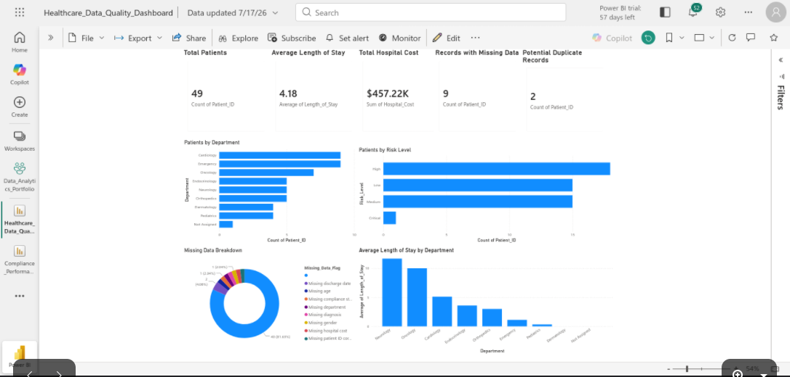
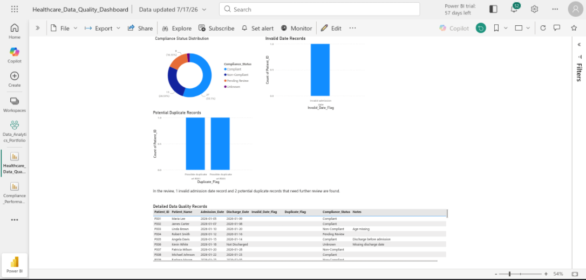

# Healthcare Data Cleaning and Data Quality Dashboard

## Project Overview

This project demonstrates an end-to-end healthcare data-cleaning and data-quality analysis workflow using Microsoft Excel, Microsoft Fabric, and Power BI Web. The source dataset was reviewed and prepared to identify missing values, invalid dates, potential duplicate records, and other data-quality concerns before being used for reporting.

The completed Power BI report contains two pages:

1. **Healthcare Overview** – Presents key healthcare metrics, including total patient records, average length of stay, total hospital cost, records with missing data, potential duplicate records, patients by department, and patients by risk level.

2. **Data Quality Details** – Provides a detailed review of compliance status, invalid admission dates, potential duplicate records, and individual records requiring further investigation.

The dashboard was created in Microsoft Fabric through a web browser on Linux. The project shows how cleaned healthcare data can be transformed into an interactive report that helps analysts identify data-quality risks and support more reliable business and operational decisions.

## Business Problem

Healthcare organizations depend on accurate patient and operational data for reporting, compliance monitoring, cost analysis, and decision-making. However, missing values, invalid dates, and potential duplicate records can reduce confidence in analytical results and may require additional review.

This project addresses these concerns by preparing the healthcare dataset for analysis and creating a two-page Power BI dashboard that summarizes important healthcare metrics while clearly identifying records with data-quality issues.

## Project Objectives

- Prepare the healthcare dataset for reliable analysis and reporting.
- Identify records containing missing values, invalid admission dates, and potential duplicates.
- Summarize key healthcare measures, including patient volume, average length of stay, and total hospital cost.
- Compare patient records across departments and risk levels.
- Present data-quality findings in a clear two-page Power BI dashboard.
- Provide detailed records to support further investigation and correction.

## Dataset Overview

The healthcare dataset contains 49 patient records used to evaluate operational measures and data-quality concerns. Key fields include `Patient_ID`, `Department`, `Risk_Level`, `Compliance_Status`, `Admission_Date`, `Discharge_Date`, `Hospital_Cost`, and `Duplicate_Flag`.

Additional data-quality indicators were used to identify records with missing information, invalid admission dates, and potential duplicates. These fields supported both the summary metrics on the Healthcare Overview page and the record-level analysis on the Data Quality Details page.

## Data Preparation and Cleaning

The healthcare dataset was reviewed and prepared in Microsoft Excel before being loaded into Microsoft Fabric. The cleaning process focused on making the records suitable for analysis while preserving data-quality concerns that required further review.

- Reviewed patient records for missing or incomplete information.
- Checked admission and discharge dates for invalid or inconsistent values.
- Flagged potential duplicate records for review instead of automatically deleting them.
- Preserved department, risk level, compliance status, hospital cost, and length-of-stay information for analysis.
- Organized the prepared data into the `Analysis_Ready_Data` and `Data_Quality_Report` worksheets.
- Loaded the prepared healthcare dataset into Microsoft Fabric for Power BI reporting.

## Dashboard Pages

### Healthcare Overview

The Healthcare Overview page summarizes the primary healthcare and operational measures in the prepared dataset.

Key performance indicators include:

- Total Patients: 49
- Average Length of Stay: 4.18 days
- Total Hospital Cost: $457.22K
- Records with Missing Data: 9
- Potential Duplicate Records: 2

The page also includes visual comparisons of patients by department and patients by risk level. A department slicer allows users to filter the page and review results for individual departments.

### Data Quality Details

The Data Quality Details page focuses on records that may require further investigation. It includes:

- Compliance Status Distribution
- Invalid Date Records
- Potential Duplicate Records
- A detailed patient-record table

The detailed table includes `Patient_ID`, `Department`, `Risk_Level`, `Compliance_Status`, `Admission_Date`, `Discharge_Date`, `Hospital_Cost`, and `Duplicate_Flag`. Together, these visuals help users identify specific records associated with data-quality concerns.

## Key Findings and Business Insights

- The prepared dataset contains 49 patient records, with an average length of stay of 4.18 days and a total hospital cost of approximately $457.22K.
- Nine records contain missing data, showing that incomplete information is still one of the most significant data-quality concerns in the dataset.
- Two records were identified as potential duplicates. These records should be reviewed before removal because duplicate flags indicate possible matches rather than confirmed duplicate entries.
- The risk-level distribution includes 18 records classified as High, 15 records classified as Medium, 15 records classified as Low, and 1 record classified as Critical. Records classified as High represent the largest risk category and may require additional attention.
- The compliance-status analysis identified 27 records classified as Compliant, 13 as Non-Compliant, 8 as Pending Review, and 1 as Unknown.
- One record contains an invalid admission date, demonstrating why date validation is important before healthcare data is used for reporting or operational analysis.
- The dashboard provides both summary-level and record-level views, allowing users to identify overall data-quality patterns and then investigate the specific patient records associated with those concerns. 

These findings show that the dataset is suitable for analysis while still containing missing values, potential duplicates, an invalid date, and unresolved compliance statuses that require further review. Addressing these issues would improve the reliability of future healthcare reporting and decision-making.

## Tools and Technologies

- **Microsoft Excel** - Used to review, clean, organize, and prepare the healthcare dataset before reporting.
- **Microsoft Fabric** - Used to create and manage the semantic model and Power BI report in a web browser.
- **Power BI Web** - Used to build the two-page interactive dashboard, KPI cards, charts, slicer, and detailed records table.
- **Google Docs and Microsoft Word** - Used to create and export the written portfolio report.
- **GitHub** - Used to organize and present the completed project files, documentation, dashboard screenshots, and reports.
- **Linux** - Used as the operating environment for completing the project through browser-based tools.

## Skills Demonstrated

- Healthcare data cleaning and preparation.
- Missing-data identification and data-quality validation.
- Invalid-date detection and potential duplicate-record analysis.
- Healthcare KPI development and operational analysis.
- Power BI dashboard design in Microsoft Fabric.
- Data visualization using cards, bar charts, a donut chart, and a detailed records table.
- Interactive filtering with a department slicer.
- Summary-level and record-level business analysis.
- Technical documentation and GitHub portfolio organization.

## Challenges and Solutions

- **Challenge: Completing the project on Linux without Power BI Desktop.**
  **Solution:** Used Microsoft Fabric and Power BI Web to load the prepared data, create the semantic model, and build the complete dashboard through a web browser.
  
- **Challenge: Preserving data-quality issues while preparing the dataset for analysis.**
  **Solution:** Cleaned and organized the data in Microsoft Excel while retaining indicators for missing information, invalid dates, and potential duplicate records that required further review.
    
- **Challenge: Handling possible duplicate records without incorrectly deleting valid data.**
  **Solution:** Flagged the records as potential duplicates and displayed them in the dashboard for investigation instead of automatically removing them.
  
- **Challenge: Preventing blank duplicate-flag values from distracting from the analysis.**
  **Solution:** Filtered blank values from the Potential Duplicate Records visual so it focused on the two records requiring review.
  
- **Challenge: Presenting both overall healthcare performance and detailed data-quality concerns.**
  **Solution:** Created two separate report pages: Healthcare Overview for summary metrics and Data Quality Details for issue-specific and record-level analysis.
  
## Future Improvements

- Expand the dataset to include more patient records, departments, healthcare facilities, and reporting periods.
- Develop a standardized process for correcting missing values and invalid dates after they have been reviewed.
- Add a duplicate-resolution workflow to determine whether flagged records should be merged, corrected, or retained.
- Include additional slicers for risk level and compliance status to support more detailed filtering.
- Add trend analysis for patient volume, hospital cost, and length of stay when additional time-based data becomes available.
- Create an automated data-refresh and validation process to reduce manual preparation work.
- Add drill-through functionality so users can move from summary visuals to individual records requiring investigation.

## Repository Structure

```text
Healthcare_Data_Cleaning_Project/
├── README.md
├── data/
│   └── Healthcare_Data_Cleaning.xlsx
├── reports/
│   ├── Healthcare_Data_Quality_Dashboard.pdf
│   └── Power_BI_Healthcare_Data_Quality_Portfolio_Report.docx
└── screenshots/
    ├── Healthcare_Overview.png
    └── Data_Quality_Details.png
```

## Dashboard Screenshots

### Healthcare Overview



### Data Quality Details



## Project Files

- [Healthcare Data Cleaning Excel Workbook](data/Healthcare_Data_Cleaning.xlsx)
- [Healthcare Data Quality Dashboard PDF](reports/Healthcare_Data_Quality_Dashboard.pdf)
- [Power BI Healthcare Data Quality Portfolio Report](reports/Power_BI_Healthcare_Data_Quality_Portfolio_Report.docx)

## Project Status

**Completed - July 2026**

The healthcare dataset was cleaned and prepared, the two-page Power BI dashboard was completed and tested, and the supporting report, screenshots, and project files were organized for publication in this GitHub repository.

The current version of the project is complete. The items listed under Future Improvements are planned enhancements and are not required for the present project to be considered finished.

## Author

**Shane Knight**

Entry-Level Data Analyst portfolio project focused on healthcare data cleaning, data-quality analysis, and Power BI dashboard development.
